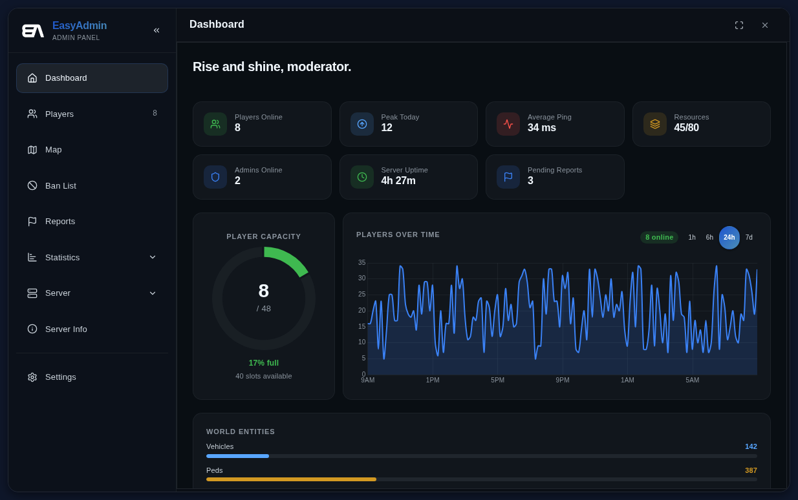
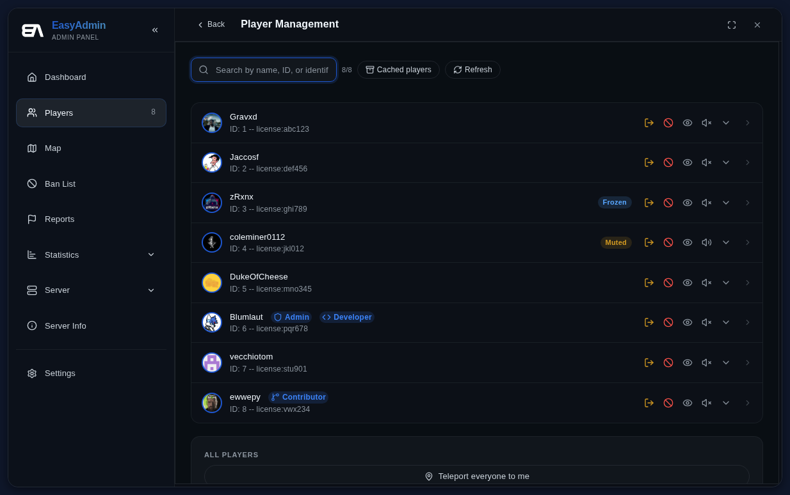
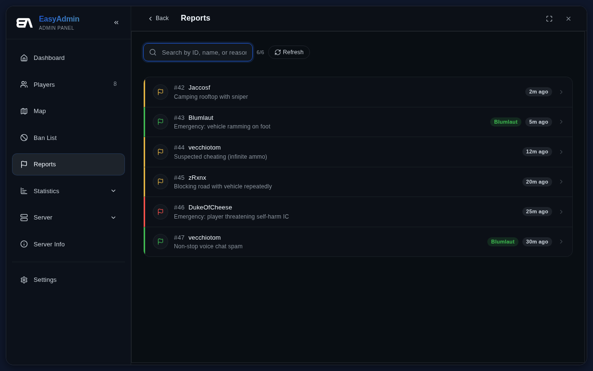
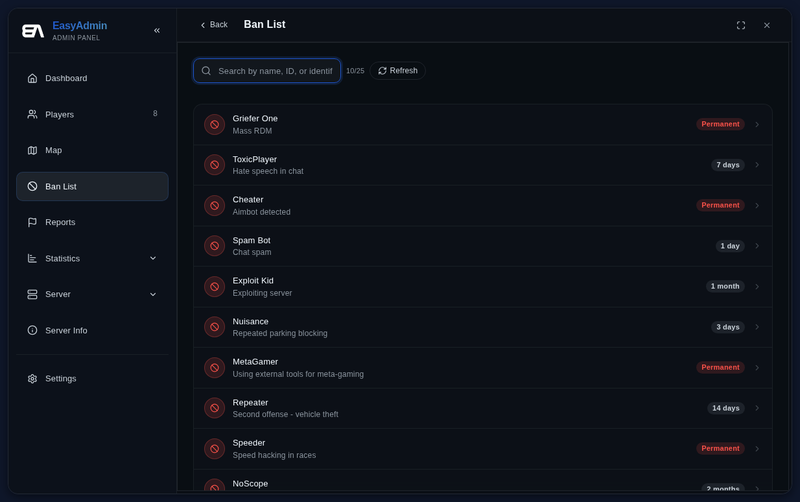
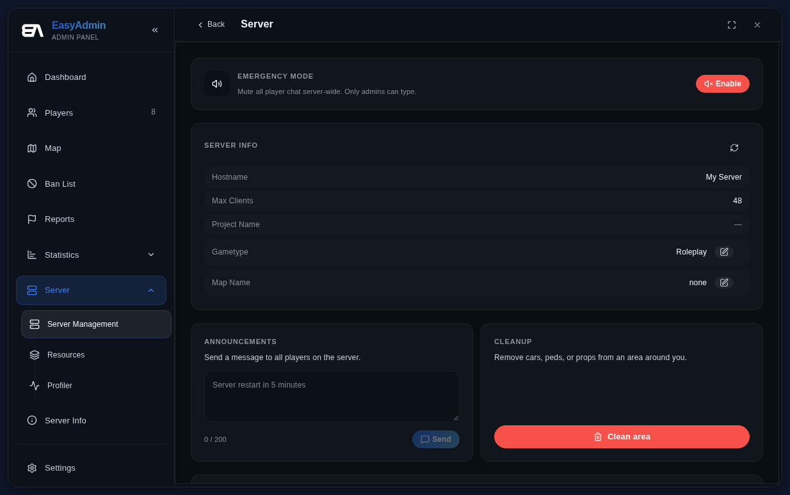

EasyAdmin is a feature-rich administration suite designed specifically for FiveM and RedM servers.

**Key Features:**

* Basic Administration: Kick players, temp/perma ban, mute, teleport, slap, freeze player, and issue warnings.
* Screenshot other Players' Game (built-in, no external resources required).
* Extensive Banlist System to prevent ban evasion.
* Modify Server Settings from a GUI.
* Report/ Admin Call System with GUI to view and handle reports.
* Extensive Permission system utilizing FiveM's inbuilt ACE System.
* Permission Editor for real-time permission modification, saving changes to a config file.
* Various Server Admin Tools, including cleaning up spawned vehicles, pedestrians, and props.
* API for developers to communicate with EasyAdmin.
* Translation support in 7 languages (community-driven).
* Actively supported and updated since 2017.
* Screen Reader Mode for visually impaired users

 
**Additional Features:**

* Plugin Support
* Fully integrated Discord Bot, featuring:
	+ Discord ACE Permissions
	+ Chat Bridge
	+ Commands
	+ Logs
* Configurable ban screens for customizing server branding and colors using easy-to-use convars.
* [An extensive Documentation](https://easyadmin.readthedocs.io/) for installation and configuration instructions.










### Installation

Visit our Documentation [https://easyadmin.readthedocs.io/](https://easyadmin.readthedocs.io/) for detailed installation and configuration instructions.

### Building Locally

For developers and contributors:

```bash
git clone <repo>
cd EasyAdmin
npm run install:all
npm run build
```

- `npm run install:all` — Install dependencies for the Discord bot and NUI
- `npm run build` — Bundle both the bot and NUI
- `npm run build:bot` / `npm run build:nui` — Build individually
- `npm run lint:all` / `npm run lint:nui` — Run linting and type checks


## Support

Join our Discord community: [https://discord.gg/snaily](https://discord.gg/snaily)

**Supported by:**

ZAP-Hosting (https://zap-hosting.com/easyadmin)
<a href='https://zap-hosting.com/easyadmin'></a>
Get 20% off your ZAP-Hosting subscription with code: EasyAdmin
