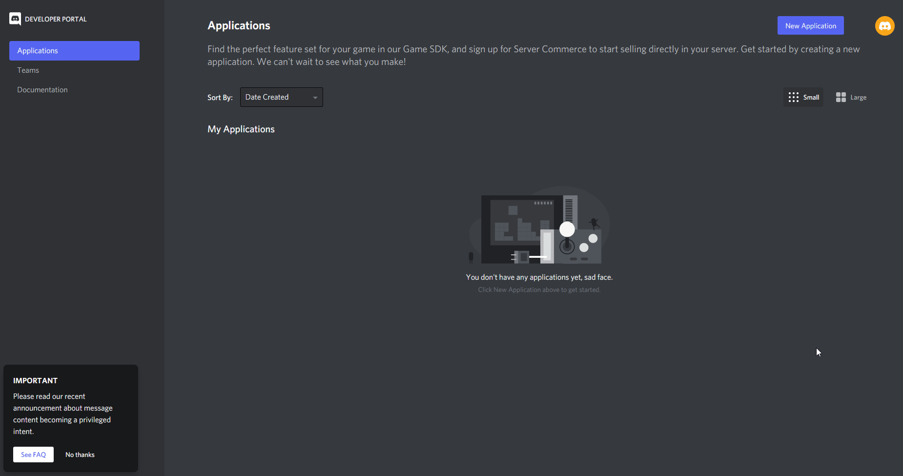

# Discord Bot

EasyAdmin 6.6 ships with a Discord bot that allows admins to manage their server entirely from Discord.


## Features

The Discord bot ships within EasyAdmin and does not need an external host to run on, this is beneficial for people running a containerized FiveM server, or are renting a server with ZAP-Hosting, as these can simply use the bot within their FiveM server.

The current feature set includes:

- Most user actions (kick, (un)ban, mute, freeze, slap, warn)
- Ability to add and remove principals, allowing discord users to be added to ACE groups on discord, without having to join or edit the server.
- A live server status, with player count infos, admins online, open&claimed reports, active entities, amount of upvotes assigned to the server and uptime
- Area cleanup for vehicles, peds and objects
- A player list with pagination (fully onesync compatible)
- A player info display (including identifiers)
- A Discord ACE Perms implementation.


## Creating the bot user

To create a bot user, we will head over to [Discord Developer Apps](https://discord.com/developers/applications) and create a new application as shown here:



> The Bot **requires** all Privileged Gateway Intents to be enabled, having these disabled will cause the bot to fail to start and trigger a `Privileged intent provided is not enabled or whitelisted` error.

## Inviting the bot

> If you are getting 401 errors, kick the Bot and invite it again using this link.

To invite the bot to your Discord server, copy the following link:

```
https://discord.com/oauth2/authorize?scope=applications.commands%20bot&permissions=277562354688&client_id=MY_BOT_ID
```

Replace `MY_BOT_ID` with your bot's application id from here:


Then simply open the link and invite the bot to your discord server!


## Configuring the Bot

To actually have EasyAdmin log into the bot, we need to configure the following convars in your server config file:

```
set ea_botToken "botToken"
```

Fill out your bot token you got from the discord developer page.

Now simply start EasyAdmin, if everything went correctly you should see:

```
[    script:EasyAdmin] Logged in as BotName#1234!
```

Message appear in your console and the bot should show as "online" on your discord server.

> The owner of the Discord server will automatically have all permissions to the bot, for other admins these need to be assigned manually (`easyadmin.bot`)

To test if the bot is working properly, you can run `/playerlist`, the output should look something like this:


## Configuring permissions

Unlike the EasyAdmin GUI, the bot permissions are all contained within the `easyadmin.bot` category, this allows restricting groups to have to do actions on the server, instead of using discord, where exact actions may not be reproducable due to changing usernames.

A list of current permissions is:

```
easyadmin.bot.add_ace
easyadmin.bot.add_group
easyadmin.bot.remove_ace
easyadmin.bot.remove_group
easyadmin.bot.ban
easyadmin.bot.unban
easyadmin.bot.baninfo
easyadmin.bot.warn
easyadmin.bot.kick
easyadmin.bot.mute
easyadmin.bot.unmute
easyadmin.bot.freeze
easyadmin.bot.unfreeze
easyadmin.bot.slap
easyadmin.bot.cleanup
easyadmin.bot.playerinfo
easyadmin.bot.playerlist
easyadmin.bot.announce
easyadmin.bot.configure
easyadmin.bot.refreshperms
easyadmin.bot.screenshot
```

For default permissions for normal admins, which are not meant to change permissions, we recommend the following preset:


```
add_ace group.admin easyadmin.bot.kick allow
add_ace group.admin easyadmin.bot.mute allow
add_ace group.admin easyadmin.bot.unmute allow
add_ace group.admin easyadmin.bot.freeze allow
add_ace group.admin easyadmin.bot.unfreeze allow
add_ace group.admin easyadmin.bot.slap allow
add_ace group.admin easyadmin.bot.playerinfo allow
add_ace group.admin easyadmin.bot.playerlist allow
```


## Configuring features


### Discord ACE Permissions

EasyAdmin's Discord bot seamlessly integrates Discord roles into FiveM's ACE system, these can be used like normal groups:

```
add_ace role:604749064436711444 easyadmin allow

add_ace role:604752112227844129 easyadmin.player allow
```

You can also let roles inherit from existing groups as described here:

```
add_principal role:604749064436711444 group.admin
```

This will cause the Discord role id `604749064436711444` to inherit all its permissions from `group.admin`.


These groups are assigned when a player joins the server, they will sync live if a member gets roles assigned or removed.
Alternatively, a user can use /refreshperms on Discord to sync their permissions.

#### Migrating from third party resources

Migrating from a third party Discord ACE permission resource is simple, in this example we will use Badger's DiscordAcePerms resource:

```
{655500055000, "group.moderator"},
```
in the rolelist becomes:

```
add_principal role:655500055000 group.moderator
```

This can then simply be added to the server.cfg or easyadmin_permissions.cfg.


### Bot logging channel

To create a log channel for the bot, simply copy the channel id (right click, Copy ID) and add the following convar to your server.cfg:

```
set ea_botLogChannel "ChannelId"
```

After rebooting your server, the bot should send it's first log message:


> Note: ea_botLogChannel prioritises over the Webhook, so if you have the Bot Log configured, the Webhook will not work.

#### Log Forwarding

Logs can be forwarded to other channels (e.g. redirected), this can be configured by adding adding `ea_addBotLogForwarding` with the specific log type and the discord channel id to the bottom of your server config, for example:

```
ea_addBotLogForwarding joinleave 604747425512685582
```

Individual logs can also be disabled by using `ea_excludeWebhookFeature`, see [Configuring](config.md).

Available log types are:
```
kick 
ban 
slap 
warn 
teleport 
freeze 
spectate 
settings 
calladmin 
report 
reports 
screenshot 
permissions 
joinleave
```


### Live server status

To enable the live server status, create a new channel on your server which is read-only to all roles except the bot, this is required as the bot will constantly update it's original message with the new server infos.


Once you have created the channel and copied it's id, you can configure it with the following convar:

```
set ea_botStatusChannel "ChannelId"
```

After rebooting your server, the bot should now post the status message in your configured channel:


### Chat bridge

> Note: a recent `chat` version from cfx-server-data is required to use the chat bridge.

The chat bridge needs its own Discord channel, it can be write-able by users, however, do note that messages sent in that channel will be sent to the FiveM server!


```
set ea_botChatBridge "ChannelId"
```

Once the convar has been configured, chat messages sent into the Discord channel will be sent into the FiveM server's chat, and vice versa.


